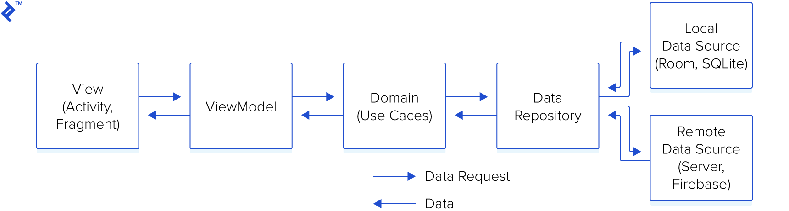

# CryptoApp
An Android App that lists all the crypto currencies with their prices in list view and its info
<ul>
<li>Home Screen list crypto currencies such as INR, USDT, WRX, BTC with their base asset and last price</li>
<li>SymbolInfo Screen displays details like Symbol, Base Asset, Quote Asset, OPen Price, High Price, Last Price, Low Price, Bid Price, Ask Price, Volume and AT</li>
<li>Crypto currency list is cached in database, handled API failure and loading cases</li>
<li>ExchangeInfoUseCase, GetExchangeInfoByCurrency , GetSymbolInfo usecases are handled</li>
</ul>

    

<b>App Features</b>
<ul>
<li>Users can view the crypto currencies with their prices and other details</li>
<li>Pull to refresh option to force fetch crypto currency list from remote</li>
<li>Offline Support</li>
</ul>

<b>App Architecture</b>

Based on MVVM with Clean Architecture.

<b>The app includes the following main components:<b>
<ul>
<li>LocalDataSource - Room database that servers as a single source of truth for data presented to the user</li>
<li>RemoteDataSource - Used to fetch api service</li>
<li>Repository- A repository that works with the database and the api service, providing a unified data interface</li>
<li>Usecases</li>
<li>ViewModel- A ViewModel that provides data specific for the UI</li>
<li>View Folder- The Jetpack Compose UI, which shows a visual representation of the data in the ViewModel</li>
</ul>

<b>App Specs</b>
<ul>
<li>Minimum SDK 21</li>
<li>Kotlin</li>
<li>Jetpack Compose</li>
<li>MVVM  with Clean Architecture</li>
<li>Android Architecture Components (LiveData, Flow, State, ViewModel, Room Persistence Library)</li>
<li>Retrofit for API integration.</li>
<li>Room Data Persistence</li>
<li>Okhttp for implementing logging </li>
</ul>
